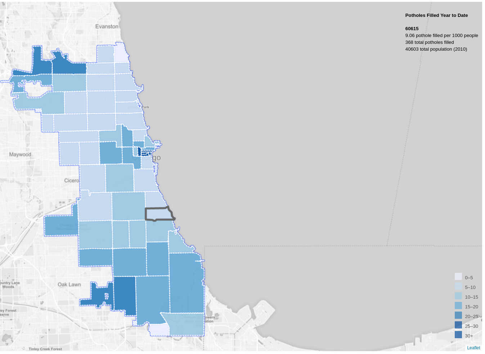

#  Using Plenario to Make Maps

## Potholes Filled Year to Date in Chicago
This map uses the Plenario API as the primary data source and supplements this information with data from the Census API

Pothole Data was pulled as of 10/07/2016 to reflect Potholes filled since the beginning of the year. Population Data is from the 2010 Census.

The Javascript library Leaflet is used to visualize the map. The map is based on a tutorial from [Leaflet](http://leafletjs.com/examples/choropleth/)

Colors for the map were selected with the help of [Color Brewer](http://colorbrewer2.org/#type=sequential&scheme=Blues&n=6)

## Using the Plenario API

Several features of Plenario were used to create this map.

The [Plenario Spatial Aggregation API](http://docs.plenar.io/#get-v1-api-shapes-lt-polygon_dataset_name-gt-lt-point_dataset_name-gt) was used to get the total number of 311 requests for potholes by zip code.

The [Time Filtering API](http://docs.plenar.io/#time-filtering) was used to filter all requests to be within the date range of the start of the current year to the present date

The [Attribute Filtering API](http://docs.plenar.io/#attribute-filtering) was used to filter for only potholes requests that had been completed.

Using Python to make the requests  creating this dataset as a geojson was done in a few lines of code:
'''
year_begin = str(datetime.datetime.now().year) + "-01-01"
current_date = str(datetime.datetime.now().year) + "-" + str(datetime.datetime.now().month) + "-" + str(datetime.datetime.now().day)

potholes  = "http://plenar.io/v1/api/shapes/boundaries_zip_codes/311_service_requests_pot_holes_reported?obs_date__ge=" + year_begin + "&obs_date__le=" + current_date + '&311_service_requests_pot_holes_reported__filter={"op":"eq", "col":"status", "val":"Completed"}'
r = requests.get(potholes)
json_out = r.text
output = json.loads(json_out)
'''

## Final Output:
Chicago Map of Potholes per 1000 people Filled Year to Date by Zip Code 

#
